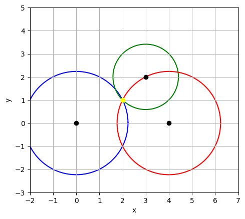

# Rebuild-Mapping-with-Distances

## Author: Josep Peiró Ramos

## Description

This algorithm reconstructs a set of points in a 2D space based on a distance matrix. While there are multiple ways to embed points given their distances, this algorithm provides a deterministic and exact method to project points in a 2D space. The orientation and direction of the space may vary, but the distances between the points remain consistent, achieving the main objective.

The algorithm works with Euclidean distances. The required input format is a square symmetric matrix, or at least a superior triangular matrix. The first diagonal must contain all 0s, and the remaining elements represent the distances between the points.

## Usage

For a practical example of how to use the `RebuildMap` algorithm, please refer to the `UseExample.py` file. This file demonstrates how to input distance data or generate random points and then reconstruct their positions.

You can find examples of distance matrix files in the EXAMPLES folder. Where you can see their structure.

## How

The algorithm uses the property that, if we know the position of 3 points and the distances from each one to a fourth point, it is possible to locate this foruth one in a 2D space.

So, here we set 3 initial points as a reference axis and locate the rest of them using the circunferences around each refence.

As we can know the equation of each circunference:
$$(x-m)^2 + (y-n)^2=d$$

As we know this formula for 3 equations (with 3 initial points) we can adquire the values of _x_ and _y_.

Is this image there is an example of how with the points: $(0,0), (0,4), (3,2)$ it is possible to set the dot $(2,1)$.

